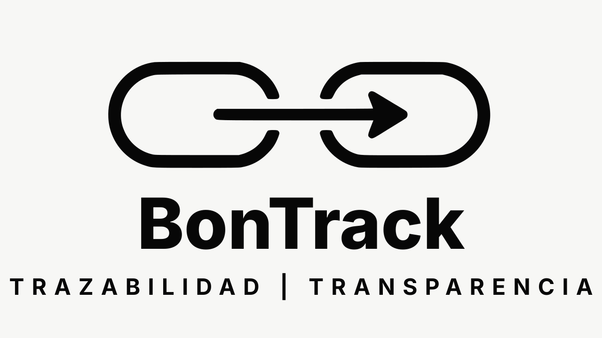

<p align="center">
  
</p>

# BonTrack

BonTrack es una plataforma para digitalizar y dar trazabilidad en tiempo real a los
certificados de cesion de deuda politica del sistema electoral costarricense. El
objetivo del MVP es claro: convertir una auditoria que hoy puede tomar 8-9 meses
de digitacion y cruce manual en una consulta publica de segundos.

El proyecto esta construido como un registro verificable para el TSE: los bonos y
sus endosos viven en Stellar/Soroban; Supabase funciona como autenticacion,
operacion y cache reconstruible para consultas rapidas.

## Problema

Los bonos de deuda politica todavia operan como documentos fisicos. Cuando un
bono se vende o endosa entre bancos, medios o personas fisicas, el TSE pierde el
rastro operativo del tenedor real hasta que recibe reportes posteriores en papel
o PDF. Eso fuerza revision manual, filas duplicadas o incompletas, y una
liquidacion lenta.

BonTrack ataca el punto de entrada mas valioso: la trazabilidad. Cada bono se
representa como un NFT especifico, cada transferencia queda registrada con precio
y timestamp, y cualquier persona puede consultar la cadena de custodia.

## Alcance Del MVP

El MVP es una demostracion funcional. En el
contexto legal actual puede operar como gemelo digital paralelo al documento
fisico; produccion plena requeriria reforma del Codigo Electoral y del
Reglamento sobre Financiamiento de Partidos Politicos.

Flujos implementados:

- Emision: un partido solicita una serie; el TSE aprueba o rechaza.
- Minteo: al aprobar, el sistema mintea N bonos on-chain.
- Colocacion: el partido transfiere un bono emitido a su primer tenedor.
- Endoso: el tenedor actual transfiere a otro tenedor y el movimiento queda registrado.
- Consulta: TSE, partido, tenedor y publico consultan trazabilidad.
- Reconciliacion: el indice Supabase puede verificarse contra Stellar.

Fuera de alcance actual:

- Redencion ante Tesoreria Nacional.
- Cierre/freeze del periodo electoral.
- Anulacion automatica por umbral electoral.
- Administracion completa de organizaciones y representantes.
- Validacion oficial contra RNPN o registros bancarios.
- Notificaciones push/inbox.

## Usuarios Y Roles

| Rol | Ruta | Responsabilidad |
|---|---|---|
| Publico | `/` y `/bono/[tokenId]` | Consulta bonos por identidad o cedula y revisa historial completo. |
| TSE | `/tse` | Revisa solicitudes pendientes, aprueba/rechaza emisiones y consulta trazabilidad. |
| Partido | `/partido` | Solicita emisiones, ve sus bonos, coloca bonos emitidos y revisa actividad. |
| Tenedor | `/tenedor` | Ve su cartera, consulta historiales y endosa bonos. |

La autenticacion usa Supabase Auth con perfiles internos (`tse`, `partido`,
`tenedor`). El acceso a datos sensibles pasa por API routes con `service_role`;
las tablas tienen RLS habilitado sin politicas abiertas para clientes anonimos.

## Arquitectura

```text
Frontend Next.js / React
        |
        v
Next.js API routes
  - auth y roles
  - validaciones de aplicacion
  - firma custodial de transacciones
  - cache de eventos
        |
        +----------------------+
        |                      |
        v                      v
Supabase                 Stellar/Soroban
Postgres/Auth            Contrato BonoNFT
wallets cifradas         metadata + owner + eventos
indice reconstruible     fuente de verdad on-chain
```

Decision central: no se usa blockchain para toda la app. Se usa donde aporta
valor regulatorio: identidad del bono, duenio actual y transferencias
irreversibles. Formularios, auth, catalogos, perfiles, dashboards y cache viven
off-chain.

## On-Chain Vs Off-Chain

| On-chain | Off-chain |
|---|---|
| Creacion del token al aprobar una emision | Autenticacion, sesiones y perfiles |
| Metadata publica e inmutable del bono | Catalogo operativo de partidos |
| Duenio actual del bono | Solicitudes de emision y revision |
| Transferencias/endosos | Dashboards, filtros y experiencia de usuario |
| Eventos verificables de custodia | Cache/indice para consultas rapidas |

La cadena es la fuente de verdad para lo que necesita inmutabilidad. La base de
datos mantiene un indice de lectura para que las pantallas respondan rapido y se
puedan reconciliar contra el contrato cuando haga falta.

## Stack

| Capa | Tecnologia |
|---|---|
| App web | Next.js 16 App Router, React 19, TypeScript |
| UI | Tailwind CSS v4, shadcn/Radix, lucide-react, motion |
| Estado/fetching cliente | TanStack Query donde aplica |
| Backend | Next.js API routes |
| Base de datos | Supabase Postgres |
| Auth | Supabase Auth |
| Blockchain | Stellar testnet + Soroban |
| Contrato | Rust, OpenZeppelin Stellar Contracts (`stellar-tokens`, `stellar-access`, `soroban-sdk`) |
| Integracion Stellar | `@stellar/stellar-sdk` |
| Seguridad de wallets | AES-256-GCM para secret keys custodiales |

## Estructura Del Repo

```text
BonTrack/
  README.md
  package.json
  contracts/
    Cargo.toml
    deployment.testnet.json
    contracts/bono_nft/
      Cargo.toml
      src/lib.rs
      src/test.rs
      test_snapshots/
  web/
    app/
      api/
      bono/
      inicio/
      login/
      partido/
      tenedor/
      tse/
    components/
    lib/
    public/
    scripts/
    supabase/migrations/
    .env.example
    DEMO.md
```

## Modelo De Datos Off-Chain

Supabase guarda datos operativos y un espejo reconstruible de la cadena.

Tablas principales:

- `wallets`: public key y secret key cifrada para wallets custodiales.
- `partidos`: catalogo de partidos, tipo de eleccion y wallet asociada.
- `holders`: tenedores normalizados por `tipo + cedula`.
- `profiles`: perfil de usuario Supabase y rol BonTrack.
- `bonos`: cache de metadata, owner actual, estado y contrato.
- `eventos`: cache de `EMISION`, `COLOCACION` y `ENDOSO`.
- `emission_requests`: solicitudes de emision y revision TSE.

Estados de solicitud:

```text
PENDIENTE -> APROBADA
PENDIENTE -> RECHAZADA
```

Estados de bono:

```text
EMITIDO -> COLOCADO -> REDIMIDO / ANULADO
```

En el MVP solo se ejecuta hasta `COLOCADO`. Las transferencias posteriores no
cambian el estado; cambian `current_owner_pubkey` y agregan eventos.

## Wallets Custodiales

El producto esta disenado para usuarios no cripto. Por eso el backend crea y
fondea wallets Stellar automaticamente usando Friendbot en testnet. La secret key
se cifra con AES-256-GCM y nunca se expone al cliente.

Cuando un usuario transfiere:

1. La API valida sesion, rol y ownership.
2. Busca o crea el tenedor destino.
3. Recupera y descifra la secret key del owner actual.
4. Firma `transfer_con_precio` contra el contrato.
5. Guarda el evento en Supabase como cache de trazabilidad.
6. Actualiza el owner actual del bono en el indice.

El modelo custodial tambien puede ser una arquitectura de produccion si se
implementa con controles adecuados: gestion de secretos fuera de la base de
datos, rotacion de llaves, auditoria, monitoreo, permisos minimos, politicas de
recuperacion y procesos operativos claros. Un modelo no custodial con wallets
externas tambien es posible, pero no es requisito para que el sistema sea viable.

## API Routes

| Ruta | Metodo | Uso |
|---|---:|---|
| `/api/trazabilidad` | `GET` | Consulta publica por bono, partido o cedula. |
| `/api/trazabilidad/reconcile` | `GET` | Verifica cache Supabase contra chain; requiere autorizacion administrativa. |
| `/api/catalogo` | `GET` | Devuelve partidos y series presentes para buscadores. |
| `/api/transfer` | `POST` | Colocacion o endoso de un bono. |
| `/api/emission-requests` | `POST` | Partido crea solicitud de emision. |
| `/api/emission-requests/[requestId]` | `PATCH` | TSE aprueba o rechaza. |
| `/api/holders/persona` | `GET` | Lookup autenticado de persona por cedula. |

Ejemplos de trazabilidad:

```bash
curl "http://localhost:3000/api/trazabilidad?mode=bono&partido=<PARTIDO>&serie=A&numero=1"
curl "http://localhost:3000/api/trazabilidad?mode=bono&page=1&pageSize=10"
curl "http://localhost:3000/api/trazabilidad?mode=cedula&cedula=1-1234-5678"
curl "http://localhost:3000/api/trazabilidad?mode=bono&partido=<PARTIDO>&serie=A&numero=1&verify=chain"
```

## Instalacion

Requisitos:

- Node.js compatible con Next.js 16.
- npm.
- Rust toolchain.
- Stellar CLI para build/deploy del contrato.
- Proyecto Supabase con Auth y Postgres.

Instalar dependencias web:

```bash
npm run install:web
```

O directamente:

```bash
cd web
npm install
```

## Variables De Entorno

Crear `web/.env.local` usando `web/.env.example` como base:

```env
NEXT_PUBLIC_SUPABASE_URL=
NEXT_PUBLIC_SUPABASE_ANON_KEY=
SUPABASE_SERVICE_ROLE_KEY=
STELLAR_NETWORK=testnet
STELLAR_RPC_URL=https://soroban-testnet.stellar.org
STELLAR_NETWORK_PASSPHRASE=Test SDF Network ; September 2015
FRIENDBOT_URL=https://friendbot.stellar.org
BONO_CONTRACT_ID=
SYSTEM_PUBLIC_KEY=
SYSTEM_SECRET=
WALLET_ENCRYPTION_KEY=
SEED_SECRET=
```

Notas:

- `BONO_CONTRACT_ID` debe apuntar al contrato de la red objetivo.
- `SYSTEM_SECRET` firma minteos como cuenta del sistema.
- `WALLET_ENCRYPTION_KEY` cifra secret keys custodiales.
- `SEED_SECRET` protege endpoints administrativos internos.

## Base De Datos

Aplicar migraciones de `web/supabase/migrations/` en orden:

```text
0001_init.sql
0002_holder_identity_constraints.sql
0003_emission_requests.sql
```

Desde SQL Editor de Supabase o con `psql`:

```bash
psql "$DB_URL" -f web/supabase/migrations/0001_init.sql
psql "$DB_URL" -f web/supabase/migrations/0002_holder_identity_constraints.sql
psql "$DB_URL" -f web/supabase/migrations/0003_emission_requests.sql
```

## Ejecutar La App

Desde la raiz:

```bash
npm run dev
```

Desde `web/`:

```bash
cd web
npm run dev
```

La app queda en `http://localhost:3000`.

Otros comandos:

```bash
npm run build
npm run lint
npm run reconcile
```

## Contratos

Tests:

```bash
cd contracts
cargo test
```

Build WASM:

```bash
cd contracts
stellar contract build
```

El contrato esta en `contracts/contracts/bono_nft/src/lib.rs`.

## Reconciliacion

Supabase es cache, no fuente de verdad. Para verificar el indice contra Stellar:

```bash
curl http://localhost:3000/api/trazabilidad/reconcile \
  -H "x-seed-secret: <ADMIN_SECRET>"
```

Tambien existe el script:

```bash
npm run reconcile
```

La reconciliacion compara:

- `owner_of(token_id)` contra `bonos.current_owner_pubkey`.
- `get_bono(token_id)` contra metadata cacheada.

## Decisiones De Diseno

- Wedge institucional: resolver trazabilidad primero, no "blockchain para todo".
- NFT por bono: cada certificado es unico, no fungible.
- Metadata on-chain: el identificador legible se deriva de datos inmutables.
- Cache off-chain: consultas instantaneas sin perder verificabilidad.
- Wallets custodiales: UX viable para TSE, partidos y tenedores no cripto.
- App-shell por rol: la UI opera como tablero institucional, no como formulario largo.
- Datos publicos: la vista publica no requiere login porque la trazabilidad es publica por ley.

## Estado Actual

Implementado:

- Contrato Soroban NFT implementado.
- Minteo real al aprobar solicitudes.
- Transferencia/endoso on-chain.
- Cache e indice Supabase.
- Login por roles.
- Vistas TSE, partido, tenedor y publica.
- Busqueda por bono, partido y cedula.
- Timeline publico por bono.
- Reconciliacion contra chain.

Pendiente para produccion:

- Reforma legal o marco de piloto paralelo formal.
- Custodia productiva de secretos con KMS/secret manager.
- Validacion oficial de identidad.
- Observabilidad y monitoreo transaccional.
- Manejo robusto de fallos parciales entre chain y cache.
- Politicas RLS finas si se abre acceso directo desde cliente.
- Congelamiento/cierre electoral.
- Redencion y anulacion.
